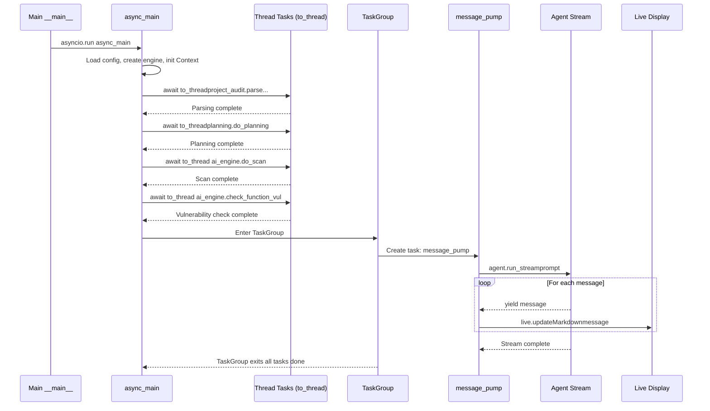

#internals

```mermaid
sequenceDiagram
    participant M as Main __main__
    participant AM as async_main
    participant TT as Thread Tasks (to_thread)
    participant TG as TaskGroup
    participant MP as message_pump
    participant AG as Agent Stream
    participant LS as Live Display

    M->>AM: asyncio.run async_main
    AM->>AM: Load config, create engine, init Context
    AM->>TT: await to_threadproject_audit.parse...
    TT-->>AM: Parsing complete
    AM->>TT: await to_threadplanning.do_planning
    TT-->>AM: Planning complete
    AM->>TT: await to_thread ai_engine.do_scan
    TT-->>AM: Scan complete
    AM->>TT: await to_thread ai_engine.check_function_vul
    TT-->>AM: Vulnerability check complete
    AM->>TG: Enter TaskGroup
    TG->>MP: Create task: message_pump
    MP->>AG: agent.run_streamprompt
    loop For each message
        AG-->>MP: yield message
        MP->>LS: live.updateMarkdownmessage
    end
    AG-->>MP: Stream complete
    TG-->>AM: TaskGroup exits all tasks done
```